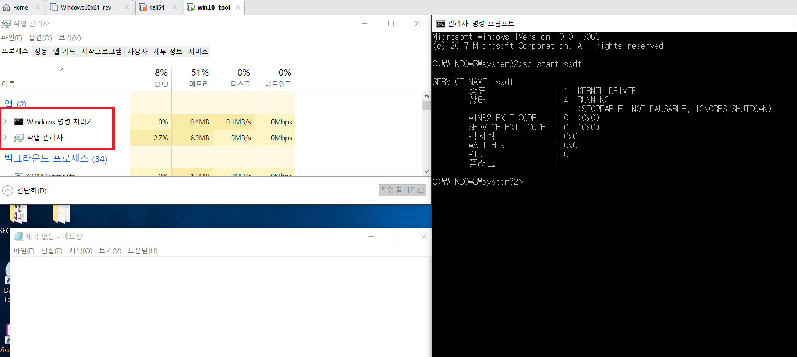

# 개요
### 구분
개발 예제

--- 
# 프로젝트
### 설명
- SSDT 후킹을 이용하여 특정 프로세스(notepad.exe)를 숨기는 드라이버 개발

### 환경
- Windows 10 x86 education

### 도구
- Microsoft Visual Studio Community 2015 
- Windows Driver Kit 10.0.15063.0 (WDK/SDK)

### 미리보기
- 후킹 전

- 후킹 후

